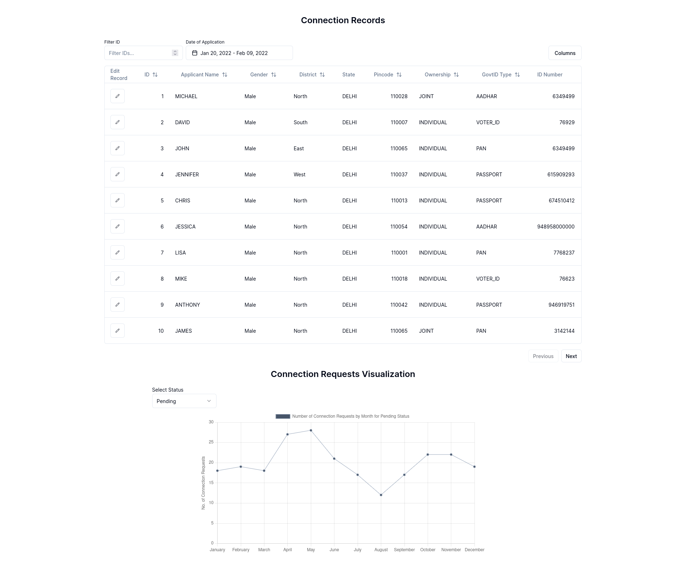
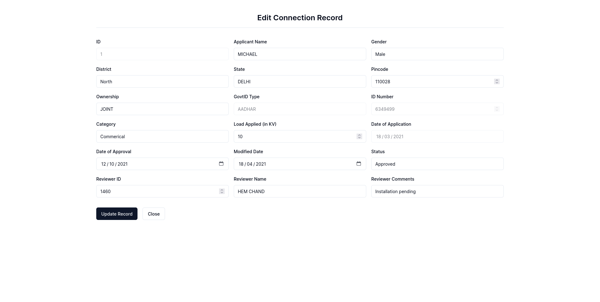

# BCG : Electric Board Case Study

## Tech Stack

- NextJS
- FastAPI
- PostgreSQL(SupaBase)

## Installation

There are three repositories in this project.

1. client
2. scripts
3. server

### Client

It is a NextJS application which consist of the frontend of the application. To run the client, you need to install the dependencies and run the application.

```bash
cd client
npm install
npm run dev
```

### Server

It is a FastAPI application which consist of the backend of the application. To run the server, you need to install the dependencies and run the application.

```bash
cd server
python -m venv venv #optional step
source venv/bin/activate #optional step
pip install -r requirements.txt
uvicorn main:app --reload
```

### Scripts

It is a python script which is used to modify the initial data. You can skip this step as initial data is already present in the database.

## Screenshots




